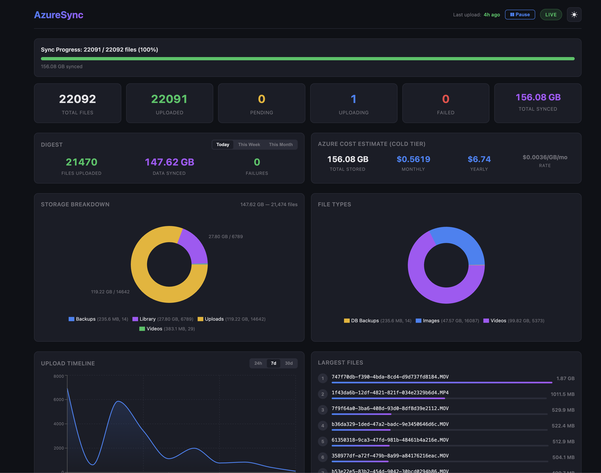
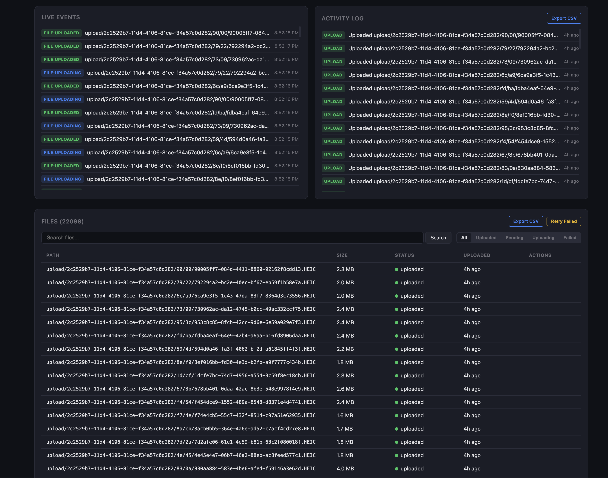
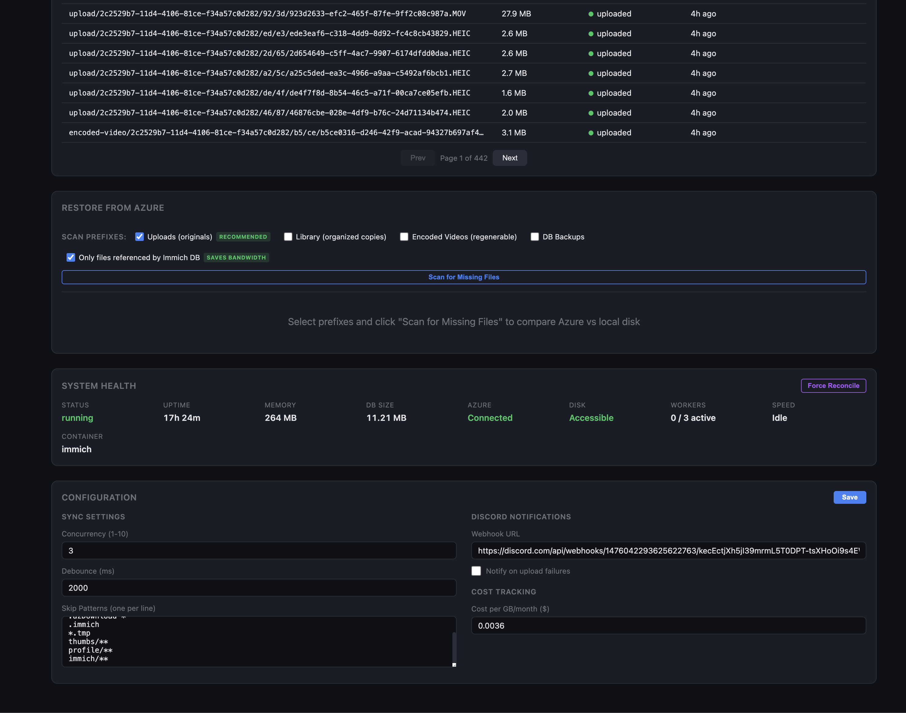

# AzureSync

Efficient file sync daemon that backs up your [Immich](https://immich.app) photo library to Azure Blob Storage. Watches for new files via inotify (zero CPU when idle), uploads only what's changed, and provides a real-time dashboard for monitoring.

## Why

Immich is great for self-hosted photo management, but your photos live on a single drive. If that drive fails, everything is gone. Cloud backup solutions either scan the entire directory repeatedly (CPU spikes) or require complex setup.

AzureSync watches your Immich directory at the kernel level — no scanning, no polling. New file appears, it gets uploaded. That's it.

## Screenshots

**Dashboard overview** — sync progress, stats, storage breakdown, cost estimate, upload timeline


**Files and events** — live upload events, activity log, searchable file list


**Restore and config** — restore from Azure, system health, configuration editor


## Features

- **inotify file watching** — zero CPU when idle, instant detection of new files
- **Startup reconciliation** — compares local files against Azure on boot, uploads anything missing
- **Upload verification** — HEAD request after each upload confirms blob integrity
- **Real-time dashboard** — WebSocket-powered React UI with live progress
- **Storage breakdown** — charts showing usage by directory and file type
- **Upload timeline** — historical upload activity graphs
- **Restore from Azure** — scan for missing local files, download from Azure with Immich DB cross-reference
- **Pause/Resume** — one-click control over upload workers
- **Retry management** — auto-retry with backoff, ENOENT detection, manual retry from dashboard
- **Discord notifications** — webhook alerts on upload failures (batched, rate-limited)
- **Config editor** — change concurrency, skip patterns, Discord webhook from the dashboard
- **Cost estimate** — monthly/yearly Azure storage cost based on synced data
- **Dark/Light theme** — toggle with localStorage persistence
- **CSV export** — download activity log and file lists
- **Docker-ready** — single container, multi-stage build

## Quick Start

```bash
# Clone
git clone https://github.com/Yogesh19921/AzureSync.git
cd AzureSync

# Configure
cp .env.example .env
# Edit .env with your Azure connection string

# Run
docker compose up -d --build

# Dashboard
open http://localhost:3420
```

## Configuration

Edit `config.json` or use the dashboard's built-in config editor:

```jsonc
{
  "azure": {
    "connectionString": "",          // or set AZURE_CONNECTION_STRING env var
    "containerName": "immich",
    "accessTier": "Cold"
  },
  "sync": {
    "basePath": "/media/usbdrive/immich",
    "watchDirs": ["library", "upload", "encoded-video", "backups"],
    "concurrency": 3,                // parallel upload workers
    "restoreConcurrency": 8          // parallel download workers
  },
  "discord": {
    "webhookUrl": "",                // optional
    "notifyOnFailure": true
  }
}
```

## Dashboard

The dashboard runs on port 3420 and includes:

- Sync progress bar with upload speed and ETA
- File counts (pending, uploading, uploaded, failed)
- Storage breakdown and file type charts
- Upload timeline (24h / 7d / 30d)
- Live event stream and activity log
- Searchable, filterable file list with error details
- Azure restore panel (scan missing files, download with progress)
- System health (Azure connectivity, memory, disk, uptime)
- Cost estimate and largest files

## Architecture

```
Watcher (inotify) → Upload Queue → Azure Blob Storage (Cold)
                         ↕
                    SQLite (state)
                         ↕
              Express + WebSocket → React Dashboard
```

See [CLAUDE.md](CLAUDE.md) for detailed architecture documentation.

## Local Development

```bash
npm install
AZURE_CONNECTION_STRING="..." npm run dev          # backend on :3420
cd frontend && npm run dev                          # frontend on :3421 (proxies backend)
```

## License

MIT

```
Copyright (c) 2026 Yogesh Kumar

Permission is hereby granted, free of charge, to any person obtaining a copy
of this software and associated documentation files (the "Software"), to deal
in the Software without restriction, including without limitation the rights
to use, copy, modify, merge, publish, distribute, sublicense, and/or sell
copies of the Software, and to permit persons to whom the Software is
furnished to do so, subject to the following conditions:

The above copyright notice and this permission notice shall be included in all
copies or substantial portions of the Software.

THE SOFTWARE IS PROVIDED "AS IS", WITHOUT WARRANTY OF ANY KIND, EXPRESS OR
IMPLIED, INCLUDING BUT NOT LIMITED TO THE WARRANTIES OF MERCHANTABILITY,
FITNESS FOR A PARTICULAR PURPOSE AND NONINFRINGEMENT. IN NO EVENT SHALL THE
AUTHORS OR COPYRIGHT HOLDERS BE LIABLE FOR ANY CLAIM, DAMAGES OR OTHER
LIABILITY, WHETHER IN AN ACTION OF CONTRACT, TORT OR OTHERWISE, ARISING FROM,
OUT OF OR IN CONNECTION WITH THE SOFTWARE OR THE USE OR OTHER DEALINGS IN THE
SOFTWARE.
```
